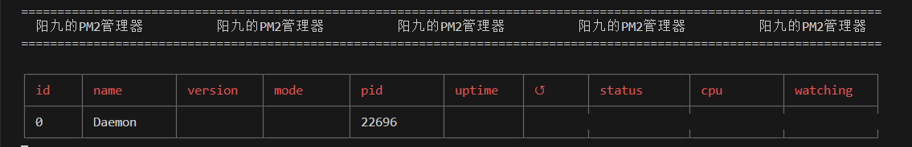

## 仿写的Lzy_PM2进程管理工具

提供功能
基本的进程控制
日志记录查询
TODO 无宕机重启
TODO cluster模式与fork模式启动进程
TODO cluster模式简易负载均衡

## EXAMPLE

~~~bash
// 进入
cd ./bin
node cli.js <command> <arg>
// 启动进程
node cli.js start ./foo.js  
// 查看进程列表
node cli.js list
// 杀死守护进程(会停止所有子进程)
node cli.js kill
// 查看某个进程日志(使用id或name)
node cli.js logs 0
~~~

## 目标架构图

- 基于原版重新设计架构

## 提供API

~~~js
- start  <path>
- list 
- log    <id>
- kill
- stop   <id>    / stopAll
- delete <id>    / deleteAll
~~~
